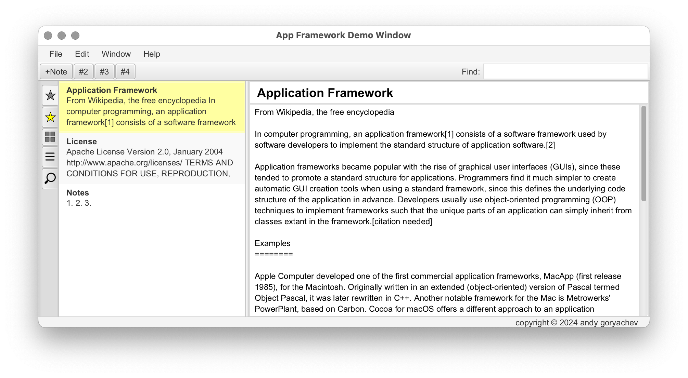

# Application Framework

Provides a convenient base for JavaFX applications.

## Features

- remembers window locations and user choices
- demonstrates common UI layouts (list/table with attached detail view, etc.)
- runtime stylesheet generator

This is pretty much work in progress, so don't even think of using it in production.

The APIs are guaranteed to change.

## Example

Please take a look at a demo application:
[AppFrameworkDemoApp.java](src/demo/appfw/AppFrameworkDemoApp.java)

This application demonstrates the basic common UI views such as list or table with attached detail view,
icon generator, actions, multiple windows, etc.

The main application window:
[MainWindow.java](src/demo/appfw/MainWindow.java)

## Software Requirements

Requires JDK 24+ with JavaFX 24+.

## License

This project and its source code is licensed under the [BSD 2-Clause License](LICENSE).

